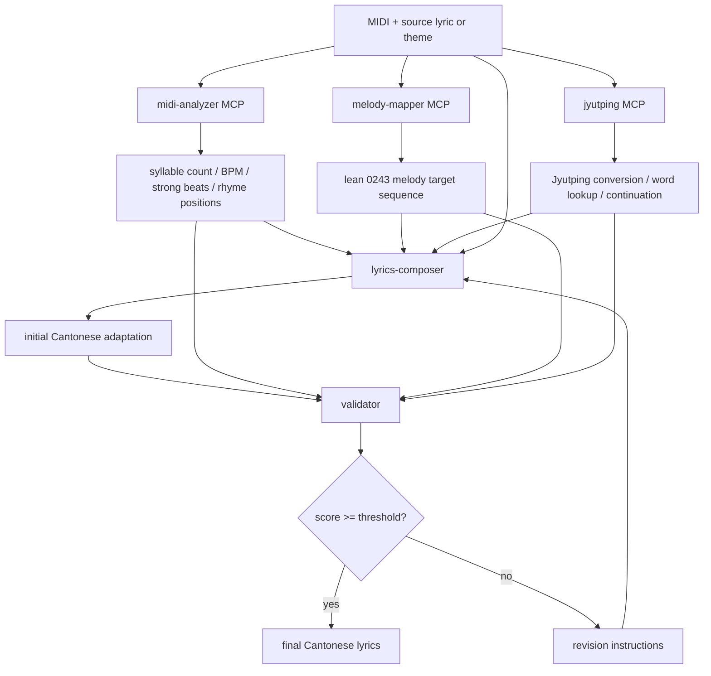

# Cantonese Lyric Adaptation Agent

> COM6104 Group Project — Multi-Agent AI System for Cantonese Lyric Adaptation and Songwriting

[English](README.md) | [Chinese](README.zh-CN.md)

---

## Project Overview

This is a **Cantonese lyric adaptation and songwriting system** built on a multi-agent AI architecture. Its primary use case is to turn a foreign-language song or an existing lyric into a singable Cantonese version. If no original lyric is provided, it can also write from a theme or scenario. Users provide a MIDI melody file together with a source lyric or theme text; the system analyses the melody structure and produces Cantonese lyrics that fit pronunciation, lean 0243 melody constraints, and rhyme.

### Architecture

The runtime flow is a melody-analysis-plus-rewriting pipeline:



| Step | Component | Role |
|------|-----------|------|
| 1 | `midi-analyzer` MCP server | Extract syllable count, BPM, strong beats, rhyme positions |
| 2 | `melody-mapper` MCP server | Derive the lean 0243 melody target sequence |
| 3 | `jyutping` MCP server | Convert candidate text, continue phrases, and query constrained words |
| 4 | `lyrics-composer` agent | Rewrite a foreign/existing lyric into singable Cantonese, or write from a theme |
| 5 | `validator` agent | Evaluate the current Cantonese adaptation and request revisions if needed |

### LLM Providers

| Provider | Config | Notes |
|----------|--------|-------|
| **Ollama** | `LLM_PROVIDER=ollama` | Runs `qwen3.5:4b` locally. No API key needed. |
| **LM Studio** (default) | `LLM_PROVIDER=lmstudio` | OpenAI-compatible API on `localhost:1234` with `qwen3.5-4b@q4_k_m`. No API key needed. |

LM Studio uses `langchain-openai`'s `ChatOpenAI` with a custom `base_url`, which is the standard LangChain pattern for OpenAI-compatible local servers.

### Requirements Compliance

| Requirement | Implementation |
|-------------|----------------|
| ≥ 2 external tools | `jyutping`, `midi-analyzer`, `melody-mapper`, `lyrics-validator` MCP servers |
| MCP protocol | Both servers use `mcp`/`fastmcp`, testable with MCP Inspector |
| Short-term memory | `ShortTermMemory` class with sliding window + structured context store |
| GitHub | This repository |

### Tech Stack

| Component | Technology |
|-----------|------------|
| LLM framework | LangChain + LangChain MCP Adapters |
| Default local LLM | LM Studio with `qwen3.5-4b@q4_k_m` |
| Alternate local provider | Ollama with `qwen3.5:4b` |
| MIDI analysis | `mido` |
| Cantonese lookup | 0243.hk API |
| MCP tooling | `mcp` + `fastmcp` |
| Short-term memory | Custom sliding-window `ShortTermMemory` |
| Agent prompts | External Markdown files in Chinese |

### Repository Layout

```text
com6104-project/
├── src/
│   ├── main.py
│   └── agent/
│       ├── config.py
│       ├── orchestrator.py
│       ├── base_agent.py
│       ├── memory.py
│       ├── registry.py
│       └── agents/
│           ├── lyrics_composer.py
│           └── validator.py
├── mcp-servers/
│   ├── jyutping/
│   │   └── server.py
│   ├── melody-mapper/
│   │   └── server.py
│   ├── midi-analyzer/
│   │   └── server.py
│   └── lyrics-validator/
│       └── server.py
├── prompts/
│   ├── system.md
│   ├── lyrics-composer.md
│   └── validator.md
├── test/
├── pyproject.toml
├── README.md
└── README.zh-CN.md
```

### Quick Start

```bash
# Install dependencies
uv sync

# Create local config
cp .env.example .env

# Pull the model for Ollama
ollama pull qwen3.5:4b

# Run once
python src/main.py --midi path/to/song.mid --text "source lyric or theme text"

# Or override in PowerShell for a one-off run
$env:LLM_PROVIDER = "lmstudio"
python src/main.py --midi path/to/song.mid --text-file test/lyrics/ドラえもんのうた.clean.txt
```

For interactive mode:

```bash
python src/main.py --interactive
```

### Environment Variables

The app automatically loads `.env` from the repository root. Shell variables and CLI flags still take precedence.

| Variable | Default | Purpose |
|----------|---------|---------|
| `LLM_PROVIDER` | `lmstudio` | LLM provider: `ollama` or `lmstudio` |
| `OLLAMA_MODEL` | `qwen3.5:4b` | Ollama model name |
| `OLLAMA_BASE_URL` | `http://localhost:11434` | Ollama server URL |
| `LMSTUDIO_MODEL` | `qwen3.5-4b@q4_k_m` | LM Studio model name |
| `LMSTUDIO_BASE_URL` | `http://localhost:1234/v1` | LM Studio API base URL |
| `LLM_TEMPERATURE` | `0.7` | Sampling temperature |
| `LLM_CTX` | `8192` | Context window size |
| `MAX_REVISION_LOOPS` | `3` | Maximum rewrite rounds |
| `MIN_QUALITY_SCORE` | `0.75` | Minimum acceptance score |
| `MEMORY_MAX_TURNS` | `20` | Sliding-window memory size |

---

### Prompt System

All prompt files live under `prompts/` and are currently authored in Chinese because the target lyric generation task and model prompting work best that way.

| File | Used By | Purpose |
|------|---------|---------|
| `prompts/system.md` | shared | Shared singing, tone, and output rules |
| `prompts/lyrics-composer.md` | `lyrics-composer` | Adaptation and rewrite guidance |
| `prompts/validator.md` | `validator` | Acceptance scoring and revision guidance |

Prompt loading priority:

1. `AgentConfig.prompt_file` in `config.py`
2. `prompts/<agent-name>.md`
3. `prompts/system.md`
4. Built-in fallback prompt text

### Extending the Project

To add a new agent:

1. Create a new class under `src/agent/agents/` that inherits from `BaseAgent`.
2. Export it from `src/agent/agents/__init__.py`.
3. Add an `AgentConfig` entry in [config.py](/D:/WebDev/com6104-project/src/agent/config.py).
4. Register the class in the orchestrator builtin mapping.

To add a new MCP server:

1. Create a new server under `mcp-servers/<name>/server.py`.
2. Add an `MCPServerConfig` entry in [config.py](/D:/WebDev/com6104-project/src/agent/config.py).
3. Add the server name to each agent's `allowed_mcp_servers` as needed.

You can inspect MCP tools locally with:

```bash
npx @modelcontextprotocol/inspector python mcp-servers/jyutping/server.py
npx @modelcontextprotocol/inspector python mcp-servers/midi-analyzer/server.py
```

### Short-Term Memory

The project uses a sliding-window `ShortTermMemory` implementation:

- It keeps the most recent conversation turns and drops older non-system messages.
- It passes structured context between agents through a dedicated `context` dictionary.
- It supports serialisation through `to_json()` and `from_json()`.

## GitHub Repository

[YuenSzeHong/com6104-project](https://github.com/YuenSzeHong/com6104-project)

---

*COM6104 Topics in Data Science and Artificial Intelligence — 2025/26 Semester 2*
