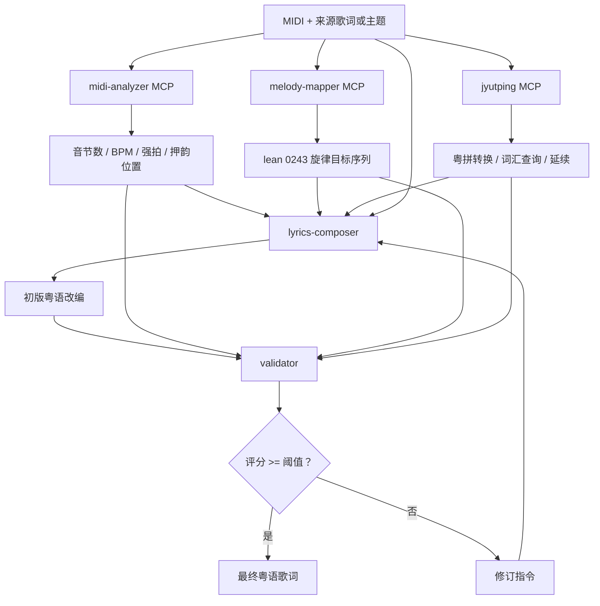

# AI 粤语填词改编 Agent

> COM6104 2025/26 Semester 2 Group Project

[English](README.md) | [中文版](README.zh-CN.md)

## 📖 项目简介

本项目是一个基于 Agentic AI 架构的粤语填词改编系统。主用途是把外语歌或现有歌词改编成可唱的粤语版本；如果用户没有提供原歌词，也可以只给主题、情景或意境文本，让系统进行原创填词。

输入为 MIDI 旋律文件与来源歌词/主题文本，系统会：
- 分析旋律的音节结构、BPM、强拍位置
- 生成符合粤语发音和押韵规则的歌词
- 确保歌词符合 lean 0243 旋律的音高模式

### 系统架构图



### 核心组件

| 步骤 | 组件 | 作用 |
|------|------|------|
| 1 | `midi-analyzer` MCP 服务 | 提取音节数、BPM、强拍、押韵位置 |
| 2 | `melody-mapper` MCP 服务 | 推导 lean 0243 旋律目标序列 |
| 3 | `jyutping` MCP 服务 | 转换候选文本、延续词组、查询受限词汇 |
| 4 | `lyrics-composer` Agent | 将外语/现有歌词改写为可唱的粤语，或从零创作 |
| 5 | `validator` Agent | 评估当前粤语改编质量，必要时请求修订 |

## 🛠️ 技术栈

| 组件 | 技术 |
|------|------|
| LLM 框架 | LangChain + LangChain MCP Adapters |
| 默认本地 LLM | LM Studio 使用 `qwen3.5-4b@q4_k_m` |
| 备用本地提供者 | Ollama 使用 `qwen3.5:4b` |
| MIDI 分析 | `mido` 库 |
| 粤语查询 | 0243.hk API |
| MCP 工具 | `mcp` + `fastmcp` |
| 短期记忆 | 自定义滑动窗口 `ShortTermMemory` |
| Agent 提示词 | `prompts/` 目录下的中文 Markdown 文件 |

## 📁 仓库结构

```text
com6104-project/
├── src/
│   ├── main.py
│   └── agent/
│       ├── config.py
│       ├── orchestrator.py
│       ├── base_agent.py
│       ├── memory.py
│       ├── registry.py
│       └── agents/
│           ├── lyrics_composer.py
│           └── validator.py
├── mcp-servers/
│   ├── jyutping/
│   │   └── server.py
│   ├── melody-mapper/
│   │   └── server.py
│   ├── midi-analyzer/
│   │   └── server.py
│   └── lyrics-validator/
│       └── server.py
├── prompts/
│   ├── system.md
│   ├── lyrics-composer.md
│   └── validator.md
├── test/
├── pyproject.toml
├── README.md
└── README.zh-CN.md
```

## ⚡ 快速开始

### 安装依赖

```bash
uv sync
```

### 创建本地配置

```powershell
Copy-Item .env.example .env
```

### 拉取模型（Ollama 使用）

```bash
ollama pull qwen3.5:4b
```

### 运行一次

```bash
python src/main.py --midi path/to/song.mid --text "source lyric or theme text"
```

### 或覆盖配置（PowerShell 一次性运行）

```powershell
$env:LLM_PROVIDER = "lmstudio"
python src/main.py --midi path/to/song.mid --text-file test/lyrics/ドラえもんのうた.clean.txt
```

### 交互式模式

```bash
python src/main.py --interactive
```

## ⚙️ 环境变量

应用会自动加载仓库根目录下的 `.env` 文件，Shell 变量和 CLI 标志优先级更高。

| 变量 | 默认值 | 作用 |
|----------|---------|------|
| `LLM_PROVIDER` | `lmstudio` | LLM 提供者：`ollama` 或 `lmstudio` |
| `OLLAMA_MODEL` | `qwen3.5:4b` | Ollama 模型名称 |
| `OLLAMA_BASE_URL` | `http://localhost:11434` | Ollama 服务地址 |
| `LMSTUDIO_MODEL` | `qwen3.5-4b@q4_k_m` | LM Studio 模型名称 |
| `LMSTUDIO_BASE_URL` | `http://localhost:1234/v1` | LM Studio API 基础地址 |
| `LLM_TEMPERATURE` | `0.7` | 采样温度 |
| `LLM_CTX` | `8192` | 上下文窗口大小 |
| `MAX_REVISION_LOOPS` | `3` | 最大修订轮数 |
| `MIN_QUALITY_SCORE` | `0.75` | 最低接受评分 |
| `MEMORY_MAX_TURNS` | `20` | 滑动窗口记忆大小 |

## 📋 提示词系统

所有提示词文件位于 `prompts/` 目录，使用中文编写，因为目标歌词生成任务和模型提示最适合用中文。

| 文件 | 使用者 | 作用 |
|------|--------|------|
| `prompts/system.md` | 共享 | 共享演唱、音调和输出规则 |
| `prompts/lyrics-composer.md` | `lyrics-composer` | 改编和改写指导 |
| `prompts/validator.md` | `validator` | 接受度评分和修订指导 |

**提示词加载优先级：**

1. `config.py` 中的 `AgentConfig.prompt_file`
2. `prompts/<agent-name>.md`
3. `prompts/system.md`
4. 内置的备用提示词文本

## 🧩 扩展项目

### 添加新 Agent

1. 在 `src/agent/agents/` 下创建新类，继承 `BaseAgent`
2. 在 `src/agent/agents/__init__.py` 中导出它
3. 在 `src/agent/config.py` 中添加 `AgentConfig` 条目
4. 在 orchestrator 的内置映射中注册该类的

### 添加新 MCP 服务

1. 在 `mcp-servers/<name>/server.py` 下创建新服务
2. 在 `src/agent/config.py` 中添加 `MCPServerConfig` 条目
3. 根据需要，将服务名称添加到每个 agent 的 `allowed_mcp_servers`

### 本地调试 MCP 工具

```bash
npx @modelcontextprotocol/inspector python mcp-servers/jyutping/server.py
npx @modelcontextprotocol/inspector python mcp-servers/midi-analyzer/server.py
```

## 💾 短期记忆

项目使用滑动窗口 `ShortTermMemory` 实现：

- 保留最近的对话轮次，丢弃旧的非系统消息
- 通过专用 `context` 字典在 Agent 之间传递结构化上下文
- 支持序列化：`to_json()` 和 `from_json()` 方法

## 🐙 GitHub 仓库

[YuenSzeHong/com6104-project](https://github.com/YuenSzeHong/com6104-project)

---

*COM6104 数据科学与人工智能专题 — 2025/26 学年 第 2 学期*